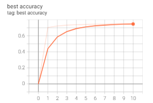
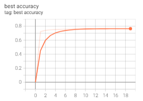
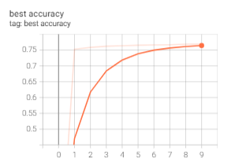

# Finetune with knowledge distillation

* Finetune Resnet50/Resnet101/ViT/DeiT on ImageNet
* Framework: PyTorch
* Dataset: ImageNet

## Finetune

The learning rate is set to 0.001 by default. And we have alpha=0.5, T=1 in loss function. The corresponding tensorboard summary writer and model parameters will be found in ./{args.model}_log_dir

-- Finetune a Resnet50 model with knowledge distillation
```
nohup python -u main_finetune.py >>./r50.log 2>&1 &
```

-- Finetune a Resnet101 model with knowledge distillation
```
nohup python -u main_finetune.py --batch_size 640 --epochs 20 --model Resnet101 >>./r101.log 2>&1 &
```

-- Finetune a Vision Transformer model with knowledge distillation
```
nohup python -u main_finetune.py --batch_size 640 --epochs 20 --model ViT >>./ViT.log 2>&1 &
```

-- DeiT model can also be finetuned in a similar way

## Results

| Model                   | Epoch              |  Teacher model accuracy  |  Model accuracy  |
| :------------------:    | :----------------: | :-----------------:      |:----------------:|
| Resnet50                | 11                 |  76.13%                  | 75.1%            |
| Resnet101               | 20                 |  77.4%                   | 76.48%           |
| ViT                     | 10                 |  75.7%                   | 76.9%            |

These are the best accuracy curve of Resnet50, Resnet101, ViT in order below.




